# Design Document

## Overview

The Band Practice Webapp is a client-server web application that enables musicians to practice with YouTube audio by providing track separation and advanced playback controls. The system consists of a React-based frontend for user interaction and audio playback, a Node.js backend for YouTube audio extraction, and integration with an external audio processing service for track separation and BPM detection.

The application follows a three-phase workflow: audio acquisition (YouTube download), audio processing (track separation and analysis), and interactive playback (mixing and control interface).

## Architecture

### High-Level Architecture

```mermaid
graph TB
    A[React Frontend] --> B[Node.js Backend :3000]
    B --> C[YouTube Audio Extractor ✅]
    B -.-> D[Local Demucs Service :8000 ✅]
    D --> E[Demucs htdemucs_6s Model ✅]
    D --> F[Librosa BPM Detection ✅]
    D --> G[File Management System ✅]
    D --> H[HTTP File Serving ✅]
    A --> I[Web Audio API]
    I --> J[Audio Context]
    J --> K[Individual Track Players]
    
    subgraph "Local Processing - OPERATIONAL"
        D
        E
        F
        G
        H
    end
    
    subgraph "Status Legend"
        L[✅ Implemented & Tested]
        M[⚠️ Needs Integration Fix]
        N[🔄 In Development]
    end
    
    style D fill:#90EE90
    style E fill:#90EE90
    style F fill:#90EE90
    style G fill:#90EE90
    style H fill:#90EE90
```



### Component Interaction Flow

1. **Audio Acquisition Phase**: User submits YouTube URL → Backend extracts audio → Audio file stored temporarily
2. **Processing Phase**: Audio file sent to Audio Processing Service → Tracks separated and BPM detected → Results returned to backend
3. **Playback Phase**: Frontend loads separated tracks → Web Audio API manages playback → User controls mixing parameters

### Technology Stack

- **Frontend**: React with TypeScript, Web Audio API for audio playback
- **Backend**: Node.js with Express, youtube-dl-exec for YouTube audio extraction
- **Audio Processing**: Local Python Flask service with Facebook's Demucs and librosa
- **Storage**: Local temporary file storage for audio processing pipeline
- **Communication**: REST API between frontend/backend, HTTP API for local audio processing service
- **AI Models**: Demucs htdemucs model for high-quality source separation

## Components and Interfaces

### Frontend Components

#### MainPage Component
- **Purpose**: YouTube URL input and download initiation
- **Interface**: 
  - Input field for YouTube URL validation
  - Submit button with loading states
  - Progress indicator for download status
  - Error display for invalid URLs or download failures

#### TrackView Component
- **Purpose**: Main practice interface with separated tracks
- **Interface**:
  - Track list with individual controls per track
  - Global playback controls (play/pause/seek)
  - BPM display
  - Navigation cursor with timeline

#### TrackController Component
- **Purpose**: Individual track control interface
- **Interface**:
  - Mute/unmute toggle button with active state styling
  - Solo toggle button with active state styling
  - Volume slider (0-100% range)
  - Pan control (-100% left to +100% right)
  - Track name/instrument label
  - Visual feedback for control states
  - Dimming effects for non-playing tracks

#### AudioPlayer Service
- **Purpose**: Web Audio API abstraction for multi-track playback
- **Interface**:
  - `loadTracks(trackUrls: string[]): Promise<void>`
  - `play(): void`
  - `pause(): void`
  - `seek(position: number): void`
  - `setTrackVolume(trackIndex: number, volume: number): void`
  - `setTrackPan(trackIndex: number, pan: number): void`
  - `muteTrack(trackIndex: number, muted: boolean): void`
  - `soloTrack(trackIndex: number, soloed: boolean): void`
  - `updateTrackAudioLevels(): void` (private method for managing solo/mute interactions)

### Backend Components

#### YouTube Downloader Service
- **Purpose**: Extract audio from YouTube URLs
- **Interface**:
  - `POST /api/download` - Accepts YouTube URL, returns download job ID
  - `GET /api/download/:jobId` - Returns download status and progress
  - Validates YouTube URLs before processing
  - Handles download errors and timeouts

#### Audio Processing Client
- **Purpose**: Interface with external audio processing service
- **Interface**:
  - `POST /api/process` - Sends audio file for separation and analysis
  - `GET /api/process/:jobId` - Returns processing status and results
  - Manages file uploads to processing service
  - Handles processing errors and retries

#### File Management Service
- **Purpose**: Temporary storage and cleanup of audio files
- **Interface**:
  - Stores downloaded YouTube audio temporarily
  - Manages separated track files from processing service
  - Implements cleanup policies for temporary files
  - Provides secure file access URLs for frontend

### Local Audio Processing Service (Demucs)

#### Track Separation Engine
- **Purpose**: Separate audio into individual instrument tracks using state-of-the-art AI models
- **Technology**: Python Flask service with Facebook's Demucs (htdemucs model)
- **Deployment**: Local service running on localhost:8000
- **Interface**:
  - Accepts audio files in common formats (MP3, WAV, FLAC, M4A, AAC, OGG)
  - Returns separated tracks: vocals, drums, bass, other instruments
  - Provides real-time processing status and progress updates
  - Implements automatic file cleanup and job management
- **Performance**: 2-5 minutes processing time for typical 3-4 minute songs
- **Cost**: Zero ongoing costs, unlimited usage

#### BPM Detection Engine
- **Purpose**: Analyze audio tempo and rhythm
- **Technology**: Python with librosa for audio analysis
- **Interface**:
  - Analyzes original audio file for tempo detection
  - Returns BPM value as integer
  - Integrated with separation workflow for efficiency
  - Handles variable tempo and provides best-effort BPM estimation

#### Service Architecture
- **Flask Web Server**: RESTful API on port 8000 with CORS support
- **Background Processing**: Threaded job execution for non-blocking operations
- **File Management**: Automatic cleanup of files older than 24 hours
- **Error Handling**: Comprehensive error reporting and timeout management
- **Health Monitoring**: Health check endpoints and job status tracking
- **File Serving**: Direct HTTP serving of separated audio tracks from local storage

#### Implementation Status
- **✅ Service Deployment**: Successfully deployed with Python virtual environment
- **✅ Demucs Integration**: htdemucs model downloaded and operational
- **✅ Audio Processing**: Verified working with real audio files (2-5 minute processing time)
- **✅ Track Separation**: Successfully generates vocals, drums, bass, and other tracks
- **✅ File Serving**: HTTP endpoints serve separated tracks from local storage
- **✅ Health Monitoring**: Health check and job status endpoints operational
- **⚠️ Backend Integration**: Node.js FormData upload requires compatibility fixes

## Data Models

### Track Data Model
```typescript
interface Track {
  id: string;
  name: string; // e.g., "vocals", "drums", "bass", "guitar", "piano", "other"
  audioUrl: string;
  duration: number; // in seconds
  volume: number; // 0-1 range
  pan: number; // -1 to 1 range (-1 = full left, 1 = full right)
  muted: boolean;
  soloed: boolean; // true when track is soloed (isolates this track)
}
```

### Processing Job Model
```typescript
interface ProcessingJob {
  id: string;
  status: 'pending' | 'processing' | 'completed' | 'failed';
  progress: number; // 0-100 percentage
  originalAudioUrl: string;
  tracks?: Track[];
  bpm?: number;
  error?: string;
  createdAt: Date;
  completedAt?: Date;
}
```

### Audio Session Model
```typescript
interface AudioSession {
  id: string;
  youtubeUrl: string;
  title: string;
  duration: number;
  bpm?: number;
  tracks: Track[];
  currentPosition: number; // playback position in seconds
  isPlaying: boolean;
  createdAt: Date;
}
```

## Correctness Properties

*A property is a characteristic or behavior that should hold true across all valid executions of a system-essentially, a formal statement about what the system should do. Properties serve as the bridge between human-readable specifications and machine-verifiable correctness guarantees.*

### Property 1: YouTube URL validation consistency
*For any* string input, the YouTube URL validator should consistently accept valid YouTube URLs and reject invalid ones, maintaining the same validation logic across all entry points
**Validates: Requirements 1.2**

### Property 2: Download workflow state management
*For any* valid YouTube URL, the download process should progress through states (downloading → processing → complete) with appropriate UI feedback and error handling at each stage
**Validates: Requirements 1.1, 1.3, 1.4, 1.5**

### Property 3: Audio processing workflow integrity
*For any* successfully downloaded audio file, the processing workflow should separate tracks, detect BPM, and transition to track view while maintaining data integrity throughout
**Validates: Requirements 2.1, 2.2, 2.3, 2.4, 2.5**

### Property 4: Track control state consistency
*For any* track in any state, mute/unmute operations should affect only that track, and multiple tracks should maintain independent control states
**Validates: Requirements 3.1, 3.2, 3.3, 3.4, 3.5**

### Property 5: Playback synchronization invariant
*For any* set of tracks, play/pause/seek operations should maintain synchronization across all tracks, ensuring they remain aligned regardless of individual track states
**Validates: Requirements 4.1, 4.2, 4.3, 4.5**

### Property 6: Navigation cursor accuracy
*For any* playback position, the Navigation Cursor should accurately reflect the current playback time, and seeking to any valid position should update playback accordingly
**Validates: Requirements 4.3, 4.4**

### Property 7: Real-time audio control responsiveness
*For any* track, adjusting volume or pan controls should immediately apply changes to that specific track during playback, with volume-zero functioning as effective muting
**Validates: Requirements 6.1, 6.2, 6.3, 6.4, 6.5**

### Property 8: BPM analysis and display consistency
*For any* processed audio, the BPM detection should provide either a valid BPM value or appropriate error messaging, with results displayed consistently throughout the session
**Validates: Requirements 5.1, 5.2, 5.3, 5.4, 5.5**

### Property 9: UI responsiveness and consistency
*For any* user interaction or system state change, the interface should provide immediate visual feedback and maintain consistent design elements across all pages and screen sizes
**Validates: Requirements 7.2, 7.3, 7.4, 7.5**

### Property 10: Local service reliability and resource management
*For any* audio processing request to the local Demucs service, the service should either successfully separate tracks or provide clear error messages, while automatically managing disk space through file cleanup
**Validates: Requirements 8.1, 8.2, 8.3, 8.4, 8.5**
**Status**: ✅ **VALIDATED** - Service successfully processes real audio files and serves separated tracks

### Property 11: Audio separation quality and completeness
*For any* valid audio file processed by the Demucs service, the output should contain up to six separated tracks (vocals, drums, bass, guitar, piano, other) with proper file format and accessibility via HTTP endpoints
**Validates: Requirements 2.3**
**Status**: ✅ **VALIDATED** - Confirmed with real audio processing test using htdemucs_6s model

### Property 12: Solo functionality exclusivity
*For any* track that is soloed, all other tracks should be muted regardless of their individual mute states, and only soloed tracks should produce audio output
**Validates: Requirements 7.1, 7.2**

### Property 13: Solo state independence
*For any* combination of solo and mute operations, the system should maintain independent solo states per track while correctly prioritizing solo over mute for audio output decisions
**Validates: Requirements 7.3, 7.5**

### Property 14: Visual feedback consistency for track states
*For any* track state change (mute, solo, volume), the system should provide appropriate visual feedback with silenced tracks dimmed fully and muted tracks dimmed only in waveform visualization
**Validates: Requirements 8.1, 8.2, 8.3**

### Property 15: Granular progress reporting accuracy
*For any* audio processing operation, the system should provide regular progress updates with descriptive messages that accurately reflect the current processing stage
**Validates: Requirements 9.5**

### Property 16: Waveform visualization accuracy
*For any* loaded audio track, the waveform visualization should accurately represent the actual audio content with amplitude variations corresponding to signal strength and silent sections showing minimal amplitude
**Validates: Requirements 11.1, 11.2, 11.3**

## Error Handling

### Frontend Error Handling
- **Network Errors**: Retry mechanisms with exponential backoff for API calls
- **Audio Loading Errors**: Graceful degradation with error messages and retry options
- **Playback Errors**: Fallback to alternative audio formats or error reporting
- **User Input Validation**: Real-time validation with clear error messages

### Backend Error Handling
- **YouTube Download Failures**: Detailed error categorization (invalid URL, unavailable video, network issues)
- **Processing Service Errors**: Retry logic with circuit breaker pattern for external service calls
- **File System Errors**: Proper cleanup and error reporting for temporary file operations
- **Rate Limiting**: Implement rate limiting to prevent abuse of YouTube download functionality

### Audio Processing Service Error Handling
- **Unsupported Audio Formats**: Clear error messages with supported format information
- **Processing Timeouts**: Configurable timeout limits with progress reporting
- **Resource Limitations**: Queue management for processing jobs with capacity limits
- **Quality Issues**: Fallback strategies for poor audio quality or separation failures

## Deployment and Setup

### Local Development Environment

#### Audio Processing Service Setup
- **Prerequisites**: ✅ Python 3.12+, 4GB RAM, 2GB disk space
- **Installation**: ✅ Virtual environment created, dependencies installed successfully
- **Models**: ✅ Demucs htdemucs model (~300MB) downloaded and operational
- **Service Management**: ✅ Flask development server running on localhost:8000
- **File Storage**: ✅ Local directories created for uploads, processing, and separated tracks
- **Validation**: ✅ Successfully processed real audio file with 4-track separation

#### Integration with Main Application
- **Service Discovery**: ✅ Backend configured to communicate with localhost:8000
- **Health Monitoring**: ✅ Health check endpoints operational and verified
- **Error Handling**: ✅ Graceful error reporting and status tracking implemented
- **Development Workflow**: ✅ Audio service operational, backend integration needs FormData fix
- **File Upload**: ⚠️ Node.js FormData compatibility issue identified, requires resolution

#### Resource Management
- **Processing Time**: 2-5 minutes per song on typical laptop hardware
- **Memory Usage**: 2-4GB during active processing
- **Disk Usage**: ~5x original file size during processing, automatic cleanup after 24 hours
- **Concurrent Processing**: Single-threaded processing to manage resource usage

### Production Considerations
- **Scalability**: Single-instance service suitable for personal/small team use
- **Monitoring**: Built-in job tracking and status reporting
- **Backup**: No persistent data requiring backup (all processing is stateless)
- **Security**: Local-only service, no external network exposure required

### Current Implementation Status

#### ✅ Completed and Validated
- **Local Demucs Service**: Fully operational on localhost:8000
- **Audio Separation**: Successfully separates audio into 4 high-quality tracks
- **File Management**: Automatic cleanup and HTTP serving working
- **Health Monitoring**: Service health and job status endpoints functional
- **Performance**: 2-5 minute processing time for typical songs
- **Cost Model**: Zero ongoing costs, unlimited usage confirmed

#### ⚠️ Known Issues
- **Node.js Integration**: FormData upload compatibility between Node.js and Python Flask needs resolution
- **Automated Workflow**: Manual curl testing works, automated backend integration requires fix

#### 🔄 Next Steps
1. Fix Node.js FormData multipart upload handling
2. Complete frontend track playback interface
3. Implement Web Audio API integration
4. Add track control UI (mute/unmute, volume, pan)

## Testing Strategy

### Unit Testing Approach
- **Component Testing**: Individual React components with mock data and user interactions
- **Service Testing**: Backend API endpoints with mock external dependencies
- **Audio Processing**: Mock audio processing service responses for consistent testing
- **Error Scenarios**: Specific test cases for error conditions and edge cases

### Property-Based Testing Approach
- **Library**: fast-check for TypeScript/JavaScript property-based testing
- **Configuration**: Minimum 100 iterations per property test for thorough coverage
- **Integration**: Each correctness property implemented as a single property-based test
- **Tagging**: Each test tagged with format: '**Feature: band-practice-webapp, Property {number}: {property_text}**'

### Testing Coverage Requirements
- Unit tests verify specific examples, integration points, and error conditions
- Property tests verify universal properties across all valid inputs
- Both approaches provide comprehensive coverage: unit tests catch concrete bugs, property tests verify general correctness
- All property-based tests must run minimum 100 iterations
- Each correctness property must be implemented by exactly one property-based test